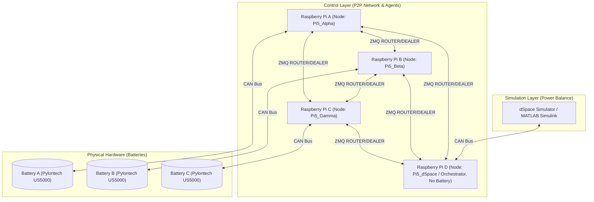

# L2EP Battery Distributed Control - Project Reference Guide

This document serves as the primary technical reference and architectural guide for the **Distributed Battery Control Testbench** project developed at the **Laboratoire d’Électrotechnique et d’Électronique de Puissance (L2EP)** in collaboration with **Centrale Lille IG2I**.

---

## 1. Project Context & Objectives

### The Challenge
Modern power grids are integrating an increasing amount of décentralized Renewable Energy Sources (RES). This transition reduces the system's mechanical inertia, historically provided by synchronous generators, leading to grid instability and frequency fluctuations.

### The Solution
A **Hardware-in-the-Loop (HIL)** experimental bench that validates decentralized battery control algorithms to regulate the grid frequency at **50 Hz** using distributed energy storage systems (Pylontech US5000 batteries).

### Key Personnel
*   **Auteur/Stagiaire:** Martin Bonnafous (Centrale Lille IG2I)
*   **Tuteur de Stage:** Antoine Jedrezak (PhD Student at L2EP researching machine learning/deep learning for battery control)
*   **Supervisors:** Bruno Francois, Ferreol Binot

---

## 2. System Architecture

The testbench is designed as a hybrid HIL loop consisting of two primary layers:



### 50 Hz Control Loop Workflow
1.  **Grid State Simulation:** The **dSpace** simulator runs a real-time Simulink model calculating grid frequency and power balance (RES production vs. consumption).
2.  **CAN Broadcast (dSpace to Pi D):** dSpace transmits grid parameters (such as frequency deviations) via the **CAN Bus** to the dedicated **Raspberry Pi D**.
3.  **Local Decision Making & P2P Exchange:** 
    *   Raspberry Pi D receives the grid status and broadcasts/exchanges these parameters with the battery agents (**Raspberry Pi A, B, C**) over the **ZeroMQ P2P network**.
    *   Each battery agent checks its own local battery status (Voltage, SoC) via CAN and calculates its power contribution setpoint.
4.  **Hardware Interaction:** Battery agents (**Raspberry Pi A, B, C**) command their respective **Pylontech US5000** batteries over CAN.
5.  **Feedback Loop:** Battery agents measure the actual power exchanged by the batteries and report it back via ZMQ to **Raspberry Pi D**, which forwards the total power feedback to **dSpace** over CAN, allowing the simulation to restore grid frequency towards **50 Hz**.

---

## 3. Technology Stack

*   **Operating System:** Raspberry Pi OS Lite (strictly required for performance and hardware support). Supports local testing/simulations on Windows.
*   **Middleware:** ZeroMQ (ZMQ) - used to establish a **brokerless** Peer-to-Peer messaging model with no single point of failure (SPOF).
*   **Programming Language:** Python 3 (with standard/venv dependency isolation).
*   **Time Synchronization:**
    *   *System Level:* **Chrony** NTP server/client configuration.
    *   *Application Level:* **Christian's Algorithm** with an elected **Time Master** (alphabetically lowest active `node_id`).
*   **Deployment:** Containerized via **Docker** using `network_mode: host` to eliminate virtual bridge latency and allow raw interface access (Ethernet, CAN).

---

## 4. Codebase Mapping

The implementation is structured under the [DEV/](file:///C:/Users/marti/Desktop/STAGE/DEV) directory. Below is a map of the file structure and responsibilities:

| File | Description | Language/Type |
| :--- | :--- | :--- |
| [`p2p_node.py`](file:///C:/Users/marti/Desktop/STAGE/DEV/p2p_node.py) | **Core Library:** Implements the `P2PNode` class, ZMQ socket patterns, thread loops, heartbeat logic, UDS listener, and time synchronization. Updated to support automatic JSON logging and Windows UDS safeguards. | Python |
| [`main_app.py`](file:///C:/Users/marti/Desktop/STAGE/DEV/main_app.py) | Main application entry point. Loads and broadcasts `data-sent.json` every 10 seconds, merging received payloads into `data-recieved.json`. | Python |
| [`battery_node.py`](file:///C:/Users/marti/Desktop/STAGE/DEV/battery_node.py) | Simulates battery telemetry (Voltage/SoC), broadcasts mock CAN frames, and logs received frames to both `battery-can.log` and the structured JSON output files. | Python |
| [`network_discovery.py`](file:///C:/Users/marti/Desktop/STAGE/DEV/network_discovery.py) | Scans the local subnet using `nmap` for ports `5555-5565` and updates `peers.json`. | Python |
| [`candump_receiver.py`](file:///C:/Users/marti/Desktop/STAGE/DEV/candump_receiver.py) | Captures physical CAN bus logs (`candump -L`), parses frames using Regex, and forwards them to the P2P node via Unix Domain Socket. | Python |
| [`orchestrate_time.py`](file:///C:/Users/marti/Desktop/STAGE/DEV/orchestrate_time.py) | Analyzes `peers.json` and outputs deployment instructions for Chrony time server/client setup. | Python |
| [`setup_time.sh`](file:///C:/Users/marti/Desktop/STAGE/DEV/setup_time.sh) | Automates the installation, configuration, and activation of Chrony on Raspberry Pi OS. | Bash Script |
| [`send_data.py`](file:///C:/Users/marti/Desktop/STAGE/DEV/send_data.py) | CLI utility to send raw or targeted messages to a running local P2PNode via UDS. | Python |
| [`run_node.py`](file:///C:/Users/marti/Desktop/STAGE/DEV/run_node.py) | Helper script to start a P2P node in a command line window and monitor connection events. | Python |
| [`latest_states.json`](file:///C:/Users/marti/Desktop/STAGE/DEV/latest_states.json) | **Output File:** Real-time state registry dictionary mapping each active `node_id` to its latest telemetry payload. | JSON |
| [`received_data_log.json`](file:///C:/Users/marti/Desktop/STAGE/DEV/received_data_log.json) | **Output File:** Historical chronological log storing all received messages in a single JSON list. | JSON |
| [`data-sent.json`](file:///C:/Users/marti/Desktop/STAGE/DEV/data-sent.json) | **Input File:** Local JSON file containing battery parameters (`power`, `soc`, `voltage`) to be broadcast. | JSON |
| [`data-recieved.json`](file:///C:/Users/marti/Desktop/STAGE/DEV/data-recieved.json) | **Output File:** Real-time state registry dictionary logging the merged states received from all peers (used by `main_app.py`). | JSON |
| [`data-recieved-history.json`](file:///C:/Users/marti/Desktop/STAGE/DEV/data-recieved-history.json) | **Output File:** Chronological history log storing all received messages in a single flat JSON list (enabled via `SAVE_HISTORY=true` or automatically on `Pi5_dSpace`). | JSON |
| [`Dockerfile`](file:///C:/Users/marti/Desktop/STAGE/DEV/Dockerfile) | Conteneur definition for Raspberry Pi environment. | Dockerfile |
| [`docker-compose.yml`](file:///C:/Users/marti/Desktop/STAGE/DEV/docker-compose.yml) | Orchestration configuration for local deployment. | YAML |

---

## 5. Protocols & Key Algorithms

### A. ZeroMQ Router/Dealer Topology
*   **Receiver (`zmq.ROUTER`):** Binds to TCP port `5555` (falls back to `5555+i` if occupied) and listens for all inbound messages. Sockets are identified by their `node_id`.
*   **Senders (`zmq.DEALER`):** A dedicated dealer socket is opened for each discovered peer inside `self.senders`, allowing asynchronous, non-blocking outbound requests.

### B. Christian's Time Synchronization & Master Election
To align battery measurements across different devices, a precise time offset must be kept:
1.  **Election:** Every node sorts the list of active peers (plus itself) alphabetically. The lowest alphabetical ID is selected as the **Time Master** (e.g., `Pi5_Alpha`).
2.  **Request:** Client nodes periodically broadcast a `TIME_REQ` containing their current local time $t_{\text{orig}}$.
3.  **Response:** The Time Master responds with a `TIME_RES` containing the original $t_{\text{orig}}$ and the server's current synced time $t_{\text{server}}$.
4.  **Offset Calculation:** The client computes the Round-Trip Time ($RTT = t_{\text{received}} - t_{\text{orig}}$) and adjusts its offset using Christian's formula:
    $$\text{offset\_sample} = (t_{\text{server}} + \frac{RTT}{2}) - t_{\text{received}}$$
5.  **Smoothing:** A moving average ($0.8 \times \text{current} + 0.2 \times \text{sample}$) prevents clock jitter:
    ```python
    self.time_offset = 0.8 * self.time_offset + 0.2 * offset_sample
    ```

### C. Resilience & Heartbeats
*   **PING Broadcast:** Every `heartbeat_interval` (default 2s), each node broadcasts a `PING` to all peers.
*   **Timeout Check:** If a registered peer hasn't been seen for longer than `timeout_threshold` (default 10s), it is removed from the active registry, closing its dealer socket and triggering a peer recalculation.

### D. Consolidated JSON Logging
When a node receives data from a peer, it automatically updates two local JSON files:
1.  **Latest State Dictionary (`latest_states.json`):**
    ```json
    {
        "battery-alpha": {
            "content": {
                "type": "CAN_FRAME",
                "id": "1A2",
                "interface": "virtual",
                "data": "V:400.0 SOC:80%",
                "timestamp": 1781081907.1107757
            },
            "timestamp": 1781081907.1107988,
            "ip": "172.31.68.232",
            "port": 5556
        }
    }
    ```
2.  **Chronological History List (`received_data_log.json`):**
    An array appending new telemetry packets sequentially.

---

## 6. Commands & Workflows Cheatsheet

### Docker Deployments
*   **Build the Node Image:**
    ```bash
    docker compose build
    ```
*   **Scan the Network for Peers:**
    ```bash
    docker compose run --rm node python network_discovery.py
    ```
*   **Launch P2P Node (Background):**
    ```bash
    export NODE_ID="Pi5_Alpha"
    docker compose up -d
    ```
*   **View Conteneur Logs:**
    ```bash
    docker compose logs -f
    ```

### Manual Node Run & Tests
*   **Run standard P2P Node:**
    ```bash
    python run_node.py
    ```
*   **Run Simulated Battery Node with JSON logging:**
    ```bash
    python battery_node.py --node-id battery-1 -p 5556 --state-file latest_states.json --log-file received_data_log.json
    ```
*   **Send Message via CLI (to UDS):**
    ```bash
    python send_data.py "Test message content"
    python send_data.py -t battery-1 "Targeted message"
    ```
*   **Run CAN Sniffer and Forwarder:**
    ```bash
    python candump_receiver.py can0 --forward --uds /tmp/p2p_node.sock
    ```

### Chrony Synchronization Orchestration
1.  Run discovery to write `peers.json`.
2.  Run orchestration helper to output target commands:
    ```bash
    python orchestrate_time.py
    ```
3.  Execute generated setup commands (Master/Client) on target Raspberry Pis:
    ```bash
    # On Master Node
    sudo bash setup_time.sh server
    
    # On Client Nodes
    sudo bash setup_time.sh client <MASTER_IP>
    ```

---

## 7. Report Compilation & Setup

The LaTeX source for the 15-page internship report is stored in [`main.tex`](file:///C:/Users/marti/Desktop/STAGE/main.tex) and [`Rapport de Stage.md`](file:///C:/Users/marti/Desktop/STAGE/Rapport%20de%20Stage.md).
*   **Compile PDF:**
    ```bash
    python compile_latex.py
    ```
    *Note: This will execute pdflatex.exe twice using MiKTeX to generate a complete table of contents, figures, and references in `main.pdf`.*

---

## 8. Environmental Constraints & Git Rules

> [!IMPORTANT]
> **Environmental Constraint:** All code must run and execute targeting **Raspberry Pi OS** on Raspberry Pi hardware.

> [!CAUTION]
> **Git Workflow Rules:**
> 1. For every file change, perform `git add` and `git commit` automatically.
> 2. **You MUST ask for user confirmation** before performing git push.
